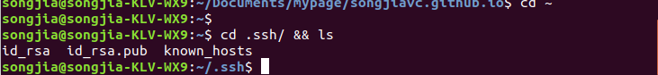

# 安装环境
    ubuntu 16.04 server 64bit
    maven 3.1
    jdk 1.8.17
    docker 18.06.1-ce
# docker 安装与配置
  _安装参考:_  https://docs.docker.com/install/linux/docker-ce/ubuntu  
  _下载地址:_  https://download.docker.com/linux/ubuntu/dists/xenial/pool/stable/amd64/docker-ce_18.06.3~ce~3-0~ubuntu_amd64.deb
## docker 安装
    $ sudo dpkg -i /path/to/package.deb
## docker切换源地址
	vi /etc/docker/daemon.json
    {
  		"registry-mirrors": ["https://registry.docker-cn.com"]
	}
## 创建docker分组
	$ sudo groupadd docker
    $ sudo usermod -aG docker $USER
    这样我们运行docker命令就不用加sudo
    docker version 验证docker安装是否成功和docker版本。
# gitlab 安装与配置
_参考:_ https://docs.gitlab.com/omnibus/docker/README.html 
里面写的很详细，不过如果不能阅读英文文档还是要先攻克一下英语。
镜像下载完成执行镜像命令
sudo docker run -d \      //后台运行
  --publish 443:443       //https 端口映射
  --publish 5003:80 \	  //web应用访问端口映射
  --publish 220:22 \      //ssh 端口映射
  --name gitlab \
  --restart always \
  --volume /home/produce/dockerdata/gitlab/config:/etc/gitlab \
  --volume /home/produce/dockerdata/gitlab/logs:/var/log/gitlab \
  --volume /home/produce/dockerdata/gitlab/data:/var/opt/gitlab \
  gitlab/gitlab-ce:latest
  配置/etc/gitlab/gitlab.rb
 external_url "http://gitlab.example.com"   //不能加端口号 否则无法访问
### 建立jenkins账号，为了在jenkins中下载gitlab上的代码使用

*注意： 创建jenkins账号最好建立Admin权限的，这样你可以git clone所有的gitlab上的项目，比较方便*

如图所示，在你要进行持续集成的项目中，选中Integrations选项，建立webhook，该webhook的地址是你 jenkins 创建project里展示的地址，如下图所示

还有一个醉醉重要的内容，就是要在安装jenkins的主机上创建ssh授信证书，并将证书中的公钥地址加入到在gitlab上创建的jenkins账号的sshkey下面
1. 创建sshkey方法
       ssh-keygen -t rsa -C  youremail@example.com  //一路默认
       git config--global user.name "your_account"
	   git config –globaluser.email youremail@example.com
       cd .ssh/ && ls
      
2. 将公钥内容添加到gitlab的sshkey 中 如下图所示：
 
# jenkins安装与配置
jenkins 应用的插件多，需要的配置环境广，所以不太适合用docker images的方式安装，这里我们直接用jenkins的war包进行安装。

  下载地址： http://mirrors.jenkins.io/war-stable/latest/jenkins.war 
    
    安装参考： https://jenkins.io/doc/pipeline/tour/getting-started/
    
    
       下载成功后，执行如下命令进行jenkins的启动
        java -jar jenkins.war --httpPort=2000 &  //设置jenkins的访问端口，初次启动会提示有一个密码字符串,以及该字符串所在的位置。
## jenkins迁移
在jenkins_home中  
    * tar -zcvf ~/jenkins.tar.gz jobs/ users/ plugins/ config.xml  * 
    备份这些内容，然后在新启动的jenkins中解压就OK 有可能涉及到一个重新读取配置的问题。

