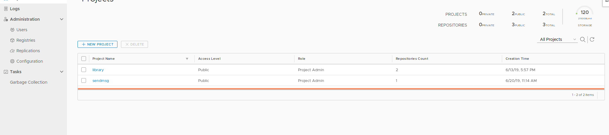

# gitlab+jenkins+maven+harbor构建ci/cd集成环境
## 前期准备
1. harbor私有仓库并创建项目

2. maven
3. docker
4. gitlab

## 配置docker-maven插件
 		
        <properties>
        	<!-- docker镜像的前缀:springboot -->
        	<docker.image.prefix>192.168.150.65/sendmsg</docker.image.prefix>
    	</properties>
         
         <plugin>
                <groupId>com.spotify</groupId>
                <artifactId>docker-maven-plugin</artifactId>
                <version>0.4.11</version>
                <configuration>
                    <!-- docker 私有仓库地址 start -->
                    <serverId>docker-harbor</serverId>
                    <registryUrl>http://192.168.150.65</registryUrl>  //私有仓库web访问地址
                    <!-- end -->
                    <imageName>${docker.image.prefix}/${project.artifactId}</imageName>  //若想提交到私有仓库必须要指定私有仓库的Ip或者域名
                    <dockerDirectory>src/main/docker</dockerDirectory>  //指定dockerfile所在路径
                    <resources>
                        <resource>
                            <targetPath>/</targetPath>
                            <directory>${project.build.directory}</directory>
                            <include>${project.build.finalName}.jar</include>
                        </resource>
                    </resources>
                </configuration>
            </plugin>
## 编写Dockerfile 
    # FROM指定使用哪个镜像作为基准
    FROM java:8
    # VOLUME为挂载路径  -v
    VOLUME /tmp
    # ADD为复制文件到镜像中
    ADD springboot-sendmsg-1.0.jar app.jar
    # RUN为初始化时运行的命令  touch更新app.jar
    RUN sh -c 'touch /app.jar'
    # ENV为设置环境变量
    ENV JAVA_OPTS=""
    # ENTRYPOINT为启动时运行的命令
    ENTRYPOINT [ "sh", "-c", "java $JAVA_OPTS -Djava.security.egd=file:/dev/./urandom -jar /app.jar" ]
 并将文件放置在src/main/docker/Dockerfile 
 ## 配置maven settings.xml
 push到私有仓库中需要docker login 所以在/home/server/.m2/settings.xml中放入login用户名密码和邮箱地址

    <server>
      <id>docker-harbor</id>
      <username>admin</username>
      <password>58songJIA58</password>
      <configuration>
      <email>sun@126.com</email>
      </configuration>
    </server>
    
 ## 执行命令
     mvn clean package docker:build -DpushImage   //直接推送镜像到私有仓库harbor
     mvn clean package docker:build -DpushImageTag   //可以指定tag
     <build>
     <plugins>
      ...
      <plugin>
       <configuration>
        ...
          <imageTags>
            <imageTag>${project.version}</imageTag>
            <imageTag>latest</imageTag>
          </imageTags>
        </configuration>
      </plugin>
      ...
    </plugins>
   </build>
## jenkins中配置webhook
## 配置ssh服务器
    用于当构建完毕使配置服务器到私有仓库中下载

 
 
 

